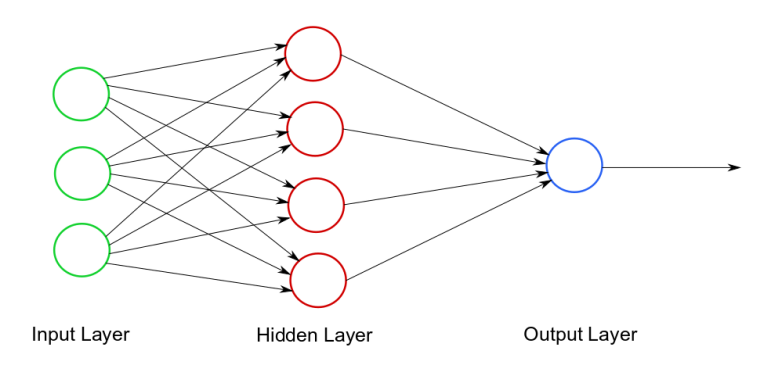
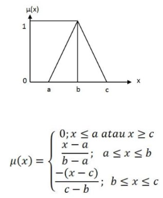
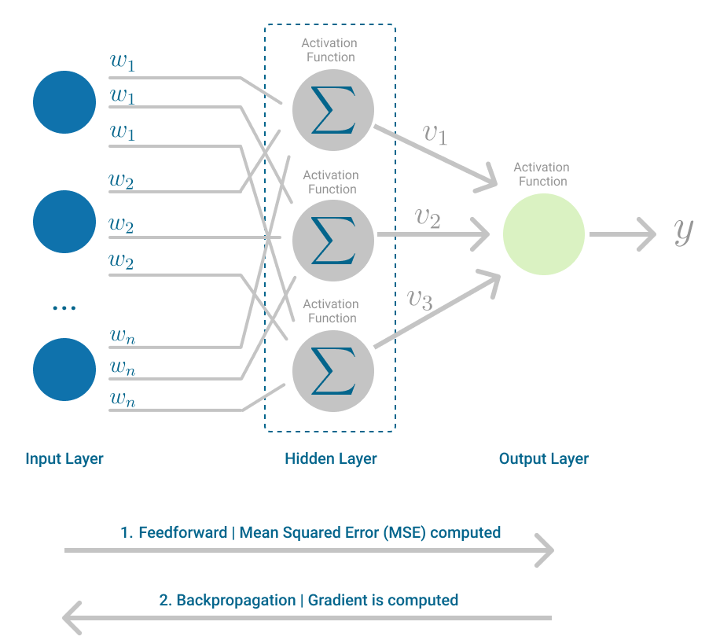
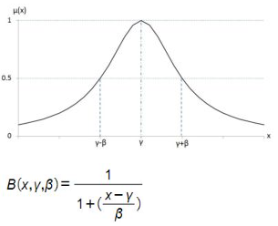

# 📘 Control System Practicum Jobsheets using Python

Welcome to the official repository of **Control System Practicum Jobsheets**. This project provides hands-on and beginner-friendly tutorials in Python for university-level students focusing on:

- **Fuzzy Logic Control**
- **Artificial Neural Networks (ANN)**

All materials are presented as **Jupyter Notebooks** with illustrative examples, diagrams, and embedded images to ensure interactive and effective learning.

---

## 🧰 Repository Structure

```

.
├── LICENSE
├── README.md
├── requirements.txt
└── Jobsheet
├── haarcascade_frontalface_default.xml       # For CV examples (used in some advanced notebooks)
├── images/                                   # Supporting diagrams and illustrations
├── jobsheet-skc-fuzzy-01a.ipynb              # Fuzzy basics: membership functions
├── jobsheet-skc-fuzzy-01b.ipynb              # Fuzzy membership function implementation
├── jobsheet-skc-fuzzy-02a.ipynb              # Fuzzy inference system (FIS)
├── jobsheet-skc-fuzzy-02b.ipynb              # Manual FIS implementation
├── jobsheet-skc-fuzzy-02c.ipynb              # Advanced FIS with Python packages
├── jobsheet-skc-fuzzy-03a.ipynb              # Case study: Temperature control using fuzzy logic
├── jobsheet-skc-fuzzy-03b.ipynb              # Homework extension: Fuzzy fan controller
├── jobsheet-skc-nn-01a.ipynb                 # Perceptron: Introduction & Implementation
├── jobsheet-skc-nn-02a.ipynb                 # Multilayer Perceptron (MLP) architecture
├── jobsheet-skc-nn-02b.ipynb                 # Training MLP with backpropagation
├── jobsheet-skc-nn-02c.ipynb                 # Real-world application: Fruit image classification
├── jobsheet-skc-nn-03a.ipynb                 # Face detection using OpenCV and Haarcascade
├── jobsheet-skc-nn-03b.ipynb                 # CNN Introduction (theory only)
├── jobsheet-skc-nn-03c.ipynb                 # (Optional) CNN Implementation using Keras (future work)
└── jobsheet-skc-nn-03d.ipynb                 # Final Project Guidelines and Wrap-Up

```

---

## 🧑‍🏫 Topics Covered

### 🧠 Fuzzy Logic Series
| Jobsheet | Topic |
|---------|-------|
| `01a` | Introduction to Fuzzy Logic and Membership Functions |
| `01b` | Triangle, Trapezoidal, Gaussian Membership Implementation |
| `02a` | Fuzzy Inference System (FIS) with Rule Base |
| `02b` | Manual FIS Design: Step-by-step |
| `02c` | Using `scikit-fuzzy` and Matplotlib for Simulation |
| `03a` | Case Study: Temperature & Fan Control using Fuzzy |
| `03b` | Home Assignment: Modify for Real-Time Fan System |

### 🤖 Neural Network Series
| Jobsheet | Topic |
|---------|-------|
| `01a` | Single-Layer Perceptron |
| `02a` | Multilayer Perceptron (MLP) Theory |
| `02b` | Backpropagation and Activation Functions |
| `02c` | Application: Apple vs Orange Classifier |
| `03a` | Face Detection using OpenCV Haarcascade |
| `03b` | CNN Introduction: Structure and Intuition |
| `03c` | CNN Implementation using Keras *(WIP)* |
| `03d` | Final Project Guidelines for Students |

---

## 🖼️ Preview Gallery

Some visual illustrations included in the jobsheets:

<p align="center">
  
  
  
  
</p>

---

## ⚙️ Installation

### 💡 Requirements
- Python 3.8 or newer
- Jupyter Notebook / JupyterLab
- Required packages: see `requirements.txt`

```bash
pip install -r requirements.txt
```

### 🧪 Recommended Environment

* Use **Anaconda** or **Miniconda** for managing virtual environments.
* Launch with:

```bash
jupyter notebook
```

---

## 📌 Learning Objectives

After completing these jobsheets, students will be able to:

* Understand and implement fuzzy membership functions
* Build simple fuzzy inference systems (manual and automated)
* Understand neural network architectures (Perceptron & MLP)
* Train and validate simple ANN models using Python
* Apply OpenCV for computer vision-based control systems
* Use Python as a simulation tool for intelligent control systems

---

## 📜 License

This project is licensed under the [MIT License](LICENSE).

---

## 👨‍🏫 Maintained By

This repository is maintained for academic and educational purposes by:

* [2black0](mailto:2black0@gmail.com)

---

## 🌟 Support & Contribution

If you find this repository helpful:

* ⭐ Star this repo
* 🐛 Open issues for bug reports or suggestions
* 📩 Pull requests are welcome!

---

## 📣 Citation

If you use this project in your teaching or research, please consider citing or crediting it in your documentation.

```
@misc{controlsystem-jobsheets,
  author       = {Ardy Seto Priambodo},
  title        = {Control System Practicum Jobsheets with Python},
  year         = {2024},
  howpublished = {\url{https://github.com/your-repo-url}},
}
```
